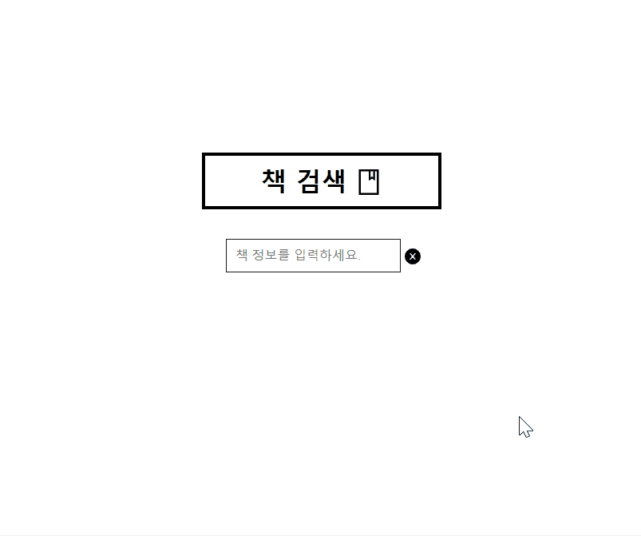

# 책 검색 사이트

- 
- redux toolkit과 오픈 api 사용하는 방법을 공부하기 위한 프로젝트
- 사용한 기술: `React`, `Redux`, `Toolkit`, `Saga`, `logger`, `antd`, `styled-components`, `http-proxy-middleware` 등
- 처음 시도하기 때문에 공식문서와 개발자들의 글을 많이 찾아 봤고, 덕분에 많은 공부과 삽질을 할 수 있었다.😅

### 목차

1. [1. 리덕스 툴킷](##-1.-리덕스-툴킷)
2. [2. api 추가 요청](##-2.-api-추가-요청)
3. [3. Proxy 서버 설정](##-3.-Proxy-서버-설정)

## 1. 리덕스 툴킷

- 이전의 프로젝트에서 리덕스를 공부했을 때 코드가 너무 길어지는 단점이 있었는데, 최근 리덕스 툴킷 사용을 권장하고 있다고 들어서 한 번 시도해봤다.
- 기존에는 초기 상태값, 액션 타입 선언, 액션 생성 함수, 리듀서 함수 이렇게 많은 데이터를 각각 작성해야 했다.
- 툴킷에는 `createSlice`를 사용하여 액션 타입 선언 + 액션 생성 함수 + 리듀서 함수를 한 번에 작성하면서 코드량을 일부분 줄일 수 있게 되었다.

```javascript
// 초기 상태값
export const initialState = {
  bookList: [], // 검색 결과 목록
  searchbookLoading: false, // 책 검색 시도 중
  searchbookDone: false,
  searchbookError: null,
  loadMoreLoading: false, // 추가 요청
  loadMoreDone: false,
  loadMoreError: null,
};

// 리듀서함수+액션타입+액션생성함수
const reducers = {
  SEARCH_REQUEST: (state) => {
    state.searchbookLoading = true;
  },
  SEARCH_SUCCESS: (state, { payload: data }) => {
    state.searchbookLoading = false;
    state.searchbookDone = true;
    state.bookList = data;
    console.log('~bookList는~', state.bookList);
  },
  SEARCH_FAILURE: (state, data) => {
    state.searchbookLoading = false;
    state.searchbookError = data.error;
  },
};

// toolkit
const slice = createSlice({
  name: 'search',
  initialState,
  reducers,
});
```

- 위 코드를 바로 컴포넌트에서 사용할 수 있게 되었다. 별도의 액션 생성 함수가 없어도 된다.

```javascript
const onSubmit = useCallback(
  (e) => {
    e.preventDefault();
    dispatch(SEARCH_REQUEST(keyword));
    count.current = 1;
  },
  [keyword, dispatch, SEARCH_REQUEST, count],
);
```

- 리듀서함수와 사가 코드를 연결할 때는 `...getDefaultMiddleware({ thunk: false })`와 같은 코드를 작성해야 한다.
- 리덕스팀에서 툴킷에 기본적으로 `thunk` 미들웨어를 제공하기 때문이다.

```javascript
import createSagaMiddleware from 'redux-saga';
import { configureStore, getDefaultMiddleware } from '@reduxjs/toolkit';
import rootReducer from './ducks';
import rootSaga from './sagas';
import logger from 'redux-logger';

const sagaMiddleware = createSagaMiddleware();

const store = configureStore({
  reducer: rootReducer,
  middleware: [...getDefaultMiddleware({ thunk: false }), sagaMiddleware, logger],
});

sagaMiddleware.run(rootSaga);

export default store;
```

## 2. api 추가 요청

- 네이버 책 검색 개발가이드를 읽고, api를 요청하여 책 정보를 받아왔다.
- 책 검색 요청 액션이 디스패치되면 사용자가 입력한 단어를 주소에 담아서 데이터 요청을 하는 방식이다.
- 비동기 코드는 `async await`을 사용하였는데, 그 이유는 `Promise`보다 깔끔하게 분기 처리하기가 좋다고 생각했기 때문이다.
- 별도의 json 변환이 필요없는 `axios`를 사용하였다.

```javascript
export async function searchBookAPI(data) {
  try {
    const response = await axios.get(`/v1/search/book.json?query=${data}&display=10`, {
      headers: {
        'Content-Type': 'application/json',
        Accept: 'application/json',
        'X-Naver-Client-Id': REACT_APP_CLIENT_ID,
        'X-Naver-Client-Secret': REACT_APP_CLIENT_SECRET,
      },
    });
    return response.data.items;
  } catch (error) {
    console.error(error);
  }
}
```

- 네이버 검색 api는 기본적으로 결과 데이터를 10개씩, 최대 100개까지 응답할 수 있다고 한다.
- 한 번에 100개씩 가져오는 것보다, 사용자가 더 필요로 할 때 추가로 데이터를 가져오고 싶었다.
- 따라서, 추가 요청 액션을 만들어서, 인피니트 스크롤링으로 검색 결과를 10개씩 추가되게 하였다.

```javascript
export async function loadmoreAPI({ data, start }) {
  try {
    const response = await axios.get(
      `/v1/search/book.json?query=${data}&start=${start.current}&display=5`,
      {
        headers: { ...

  const count = useRef(1);
```

```javascript
useEffect(() => {
  function onScroll() {
    if (
      window.scrollY + document.documentElement.clientHeight >
      document.documentElement.scrollHeight - 50
    ) {
      if (!loadMoreLoading && bookList.length > 1) {
        count.current += 10; // 추가 요청일 시, 카운트에 10을 추가하여 불러오는 시작점을 조정
        dispatch(LOADMORE_REQUEST({ data: keyword, start: count }));
      }
    }
  }
  window.addEventListener('scroll', onScroll);
  return () => {
    window.removeEventListener('scroll', onScroll);
  };
}, [keyword, dispatch, loadMoreLoading, LOADMORE_REQUEST, bookList, count]);

const onChange = useCallback((e) => {
  setKeyword(e.target.value);
}, []);

const onSubmit = useCallback(
  (e) => {
    e.preventDefault();
    console.log(keyword);
    dispatch(SEARCH_REQUEST(keyword));
    count.current = 1; // 검색결과의 다음페이지를 불러오는 숫자를 초기화
  },
  [keyword, dispatch, SEARCH_REQUEST, count],
);
```

- 스크롤이 하단부에 닿고, 이미 불러온 데이터가 있을 경우, `count`를 10씩 올렸다.
- 그렇게 되면, api 함수에 10이 추가된 지점의 데이터를 받아올 수 있게 된다.
- 첫 요청일 때는(SEARCH_REQUEST 액션) `count`를 초기화 시켰다.
- `useRef`를 사용하여 `count`를 변수처럼 사용하였다.

## 3. Proxy 서버 설정

- 브라우저는 다른 도메인으로 요청을 보낼 때 보안상의 이유로 자체 차단을 한다.
- 이러한 CORS(Cross-Origin-Resource-Sharing) 이슈를 프론트단에서 해결하기 좋은 방법은 Proxy 서버를 설정하는 것이다.
- `http-proxy-middleware` 설치 후, `setupProxy.js` 파일을 생성하여

```javascript
const { createProxyMiddleware } = require('http-proxy-middleware');

module.exports = function (app) {
  app.use(
    '/v1',
    createProxyMiddleware({
      target: 'https://openapi.naver.com',
      changeOrigin: true,
    }),
  );
};
```

- 위와 같이 작성하면, 해당 도메인으로 요청이 발생했을 때 임의적으로 주소를 IP를 변경하여 서버에 접근할 수 있게 된다고 한다.
- 백엔드 측에서 특정 주소에서의 요청을 허용하는 코드를 작성하여 해결할 수도 있다.
- 사실상 개발모드에서 임시로 사용하기 적합해보인다.
